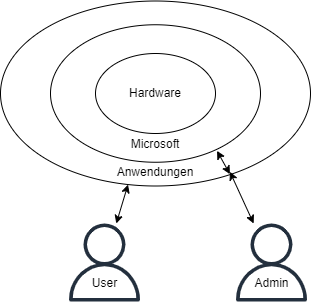

## Betriebssysteme

### Microsoft Windows vs Linux

Microsoft erlaubt keinen direkten Zugriff auf das Betriebssystem Windows. Selbst Admins werden vom Betriebssystem berechtigt, direkter Zugriff existiert nicht.

### Linux Berechtigungen

Beispiel: Datei bla.txt hat die Rechte 754 
Bedeutung:  user darf r, w, x
            group darf r, x
            alle anderen r

### Befehle in Linux

|Beschreibung|Befehl|
|--|--|
|Rechte angeben/ändern|chmod|
|Auflisten der Rechte|ls -l|
|Ändern des Eigentümers|chown|
|Ändern der Gruppe|chgrp|
|Wechseln von Verzeichnissen|cd|

### Befehle in VI

|Beschreibung|Befehl|
|--|--|
|:w|speichern|
|:q|verlassen|
|:q!|verlassen erzwingen|
|/...|nach ... suchen|
|dd|Zeile löschen|
|i|insert|
