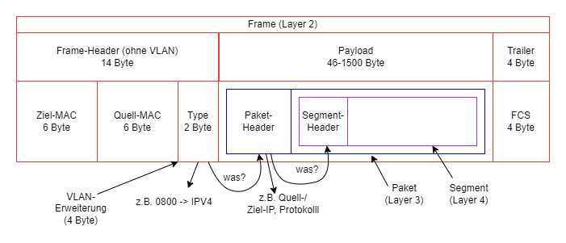

## Betriebssysteme

### Microsoft Windows vs Linux

Microsoft erlaubt keinen direkten Zugriff auf das Betriebssystem Windows. Selbst Admins werden vom Betriebssystem berechtigt, direkter Zugriff existiert nicht.

### Linux Berechtigungen

Beispiel: Datei bla.txt hat die Rechte 754 \
Bedeutung:  user darf r, w, x
            group darf r, x
            alle anderen r

### Befehle in Linux

|Befehl|Beschreibung|
|--|--|
|chmod|Rechte angeben/ändern|
|ls -l|Auflisten der Rechte (+Gruppe)|
|chown|Ändern des Eigentümers einer Datei/eines Dirs|
|chgrp|Ändern der Gruppe|
|cd|Wechseln von Verzeichnissen|
|pwd|Ausgeben des aktuellen Verzeichnispfades|
|cp|Copy|
|rm|Remove|
|touch|Anlegen einer neuen Datei oder Ändern der Metadaten einer Datei|
|cat|Ausgeben der Inhalte einer Datei|
|less|Ausgeben der Inhalte einer Datei in lesbaren Seiten|

### Befehle in VI

Befehlskontext mit ESC öffnen

|Befehl|Beschreibung|
|--|--|
|:w|speichern|
|:q|verlassen|
|:q!|verlassen erzwingen|
|/...|nach ... suchen|
|dd|Zeile löschen|
|i|insert|

## Skripting in Linux

Anordnung von Befehlen, die nacheinander abgearbeitet werden. Diese Befehle werden in eine Datei zur Wiederverwendbarkeit und Automatisierung geschrieben.

- Erste Zeile wird "Shebang"-Zeile genannt
- In der Shebang-Zeile wird die zu verwendende Shell angegeben
- #! /bin/bash (für standard-shell)

|Syntax|Bedeutung|
|--|--|
|#!|Shell-Angabe|
|#|Kommentar|
|$xxx|Ansprache der davor definierten Variable xxx|
|+%x|Formatierungsoption des vorangegangenen Befehls mit Parameter x|

- Variablendeklarationen dürfen keine Leerzeichen enthalten (z.B. varname = xxx)
- Variableninitialisierungen mit Leerzeichen (für Parameter für vordefinierte Befehle) müssen mit **\`**    **\`** (Backticks, nicht Quotation Marks) umrahmt werden

### If Else

if condition 
... 
then 
... 
else/elseif/elif 
... 
fi

### Switch Case

case condition in  
    Möglichkeit 1) ... ;; 
    Möglichkeit 2) ... ;; 
    *) ... ;; 
esac

---

## Netzwerk

- Im physischen Bereich (MAC-Adressenbasiert) wird zuerst die Ziel-MAC und dann die Quell-MAC angegeben (z.B: im Frame-Header).
- Im logischen Bereich (IP-Adressenbasiert) wird zuerst die Quell-IP und dann die Ziel-IP angegeben.
- Der Portbereich ist festgelegt auf 16 Bit (65536 (0-65535) verfügbare Ports, davon die ersten 1024 well-known Ports)
- Es können 4096 VLANs über die VLAN-Erweiterung im Frame-Header addressiert werden (die ersten zwei Byte sind für den Tag Protocol Identifier (TPID) - Bei VLANs 0x8100, die letzten 12 Bit für VLAN ID (-> max 4096))

### Aufbau eines Frames

### Frame vs Paket vs Segment

|Frame|Paket|Segment|
|--|--|--|
|Dateneinheit des Data Link Layers|Dateneinheit der Netzwerkschicht|Dateneinheit der Transportschicht|
|Layer 2|Layer 3|Layer 4|
|MAC-basiert|IP-basiert||

### TCP-Flags

- Zustandssignal
- Immer 1 Bit groß (Zustand ist an oder aus)
- Für 3-Wege-Handshake (SYN, SYN-ACK, ACK)

### PAT - Port Address Translation

Beispiel: Paket wird von PC 1 in internem Netz an Server 1 in externem Netz geschickt.

- Standardgateway ersetzt bei Paketerhalt die Quell-IP und -Port durch seine externe Schnittstelle und einem neuen Quellport für das Netz von Server 1
- Standardgateway setzt für den neuen Port eine Zuordnung zu PC 1 und dem ursprünglichen Port (Router-interne Liste)
- Bei Antwort wird anhand des Portabgleichs mit der internen Liste das richtige Ziel (PC 1 mit Quell-Port) zugeordnet
- Listeneintrag mit "Ersatzport" wird gelöscht
- PAT ist ein 1-zu-n NAT (1 PC in Privatnetz kann übersetzt werden (viele Ports, aber nur 1 PC))

### NAT - Network Address Translation

- Standardgateway ersetzt bei Paketerhalt die Quell-IP durch seine externe Schnittstelle und setzt einen Wert zur Zuordnung des Antwortpakets in die NAT-Tabelle

---

## Backup

### Vollsicherung

|Vorteile|Nachteile|
|--|--|
|||

### Differentielle Sicherung

Eine Vollsicherung wird als Basis zur differentiellen Sicherung benötigt.

|Vorteile|Nachteile|
|--|--|
|Point-In-Time Recovery ab letzter Vollsicherung|Für Recovery ist Vollsicherung und differentielle Sicherung notwendig|
|weniger Zeitaufwand|Doppelte Datensicherung (Datensatz wurde in dem Zeitraum mehrmals geändert)|

### Inkrementelle Sicherung

Eine Sicherung wird als Basis zur inkrementellen Sicherung benötigt, da immer nur die Änderungen zur letzten Sicherung gesichert werden.

|Vorteile|Nachteile|
|--|--|
|Backup benötigt weniger Speicherplatz|alle inkrementellen Sicherungen werden zur Recovery benötigt|
|sehr schnelle Backuperstellung||

### Archivbit

Das Archivbit (auch Archiv-Attribut) ist ein Dateiattribut, das in Microsoft-Betriebssystemen genutzt wird, um neu angelegte oder veränderte Dateien zu kennzeichnen. Datensicherungsprogrammen kann damit signalisiert werden, dass die Datei noch nicht gesichert bzw. seit der letzten Sicherung modifiziert wurde.

---

## GIT

- Zusammenarbeit im Team an einem Projekt
- Versionierung
- Lokale und Onlineversionen des Repos (lokal arbeiten, neuester (stable) Stand online)

---  

## SCRUM

### Meetings

#### Sprint

- Einzelne Arbeitsphasen heißen Sprints
- In den Sprints arbeitet man selbständig und teilt seine Aufgaben der Gruppe mit
- Scrum zeichnet sich vor allem durch regelmäßige und wiederholbare Arbeitsabläufe aus. Diese Zyklen werden meist Iteration oder Sprint genannt und sind zeitlich beschränkt (2 Wochen)
- Ziel eines jeden Sprints ist es, ein funktionsfähiges Zwischenprodukt, das auch Product-Increment genannt wird, zu entwickeln
- Da die Zeit eines Sprints beschränkt ist, kann sich das Scrum Team jeweils nur auf die Weiterentwicklung der grundlegenden Funktionalität des Zwischenprodukts  und auf kurzfristige Ziele konzentrieren
- Die Dauer des gesamten Sprints ist abhängig von der Deadline der/des Stakeholder:in

#### Daily Scrum

- Täglich stattfindendes Event für Developer
- Sollte nicht länger als 10-15 Minuten dauern
- Fortschritt wird überprüft und Sprint Backlog wird ggf. angepast
- Verbessert Kommunikation und identifiziert Hindernisse

#### Sprint Planning

- Festlegen der Aufgaben, welche im Sprint erledigt werden sollen
- Erstellung durch das gesamte Scrum-Team

#### Sprint Retrospective

- Erfolgt ganz am Ende, nachdem der letzte Sprint vorbei ist
- Es wird über die Zusammenarbeit, die eigene Entwicklung und die Entwicklung des Teams gesprochen
- Zuerst im eigenen Team und anschließend in der Klasse mit den Stakeholdern
- Anschließend wird über mögliche Änderungen diskutiert

#### Planning Poker

- stellt sicher, dass alle genau wissen, was mit den Aufgaben gemeint ist
- Darauf wird (mit wissen über den Aufgabeninhalt) der Zeittplan geregelt
- Vorgang:
  1. Zeitwerte werden auf Kommando aufdeckt
  2. höchsten und niedrigsten Extremwerte müssen erläutert/begründet werden

#### Sprint Review

- Am Ende jedes Sprints
- beantwortet Leitfragen oder Ergebnisse werden Product Owner vorgestellt
- Folgende Leitfragen gibt es:
  - Was haben wir heute geschafft?
  - Wo stehen wir?
  - Wie hat die Zusammenarbeit heute geklappt?
  - Inwieweit sind wir mit dem Ergebnis des heutigen Sprints zufrieden

### Artefakte

#### Akzeptanzkriterien

- gibt erfüllende Bedingungen vor
- wird vom Product Owner vorgegeben
- Beinhaltet: Inhalt, Umfang, Abgabedatum

#### User Stories

- Anforderungen an das Produkt einfach formuliert
- Wird aus Sicht des Nutzers/Kunden erstellt

#### Definition of Done

- Definiert das Projektende/Paketende (Leitfragen)
- Kriterien, die etwas als abgeschlossen markieren

#### Definition of Fun

- Gegebenheiten um mit Spaß zu arbeiten

#### Flip/Kanban Board

- Dokumentation der einzelnen Arbeitsschritte
- Auf einen Blick was noch zutun oder zu erledigen ist (To Do, In Progress, Done...)

#### Product Backlog

- Beinhaltet das Produktziel
- Ziele sind genau Formuliert
- Scrum Team orientiert sich am Backlog

### Rollen

#### Scrum Team

- Besteht üblicherweise aus 10 oder weniger Teammitgliedern 
- Besteht aus einem Product Owner, einem Scrum Master und mehreren Entwicklern
- Die Mitglieder des Teams besitzen alle erforderlichen Fähigkeiten, um in einem Sprint einen Wert zu schätzen
- Das Team managed sich intern selbst
- Arbeitet in Sprints, um in diesen ein Increment zu schaffen (Projektaufgaben erledigen)

#### Product Owner

- Product Owner ist der "Produkteigentümer"
- Mitglied des SCRUM Teams
- Zuständig für Entwicklungsprozesse
- Verantwortet Product Backlog & Product Goal
- Aufgaben wie:
  - Produktdokumentation
  - Berichte an GL
  - Teamoptimierung
  - Maximierung des Produkts

#### Scrum Master

#### Stakeholder

- Person, für die es aufgrund ihrer Interessenlage von Belang ist wie das Projekt verläuft (z. B. Aktionär, Mitarbeiter, Kunde)
