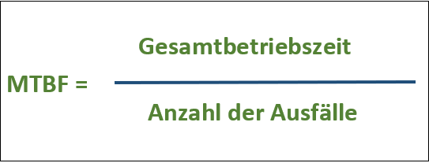
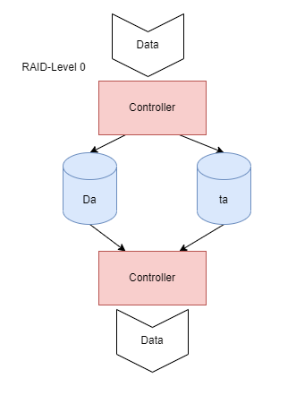

## RAID

Definition: **Redundant Array of Independent Discs**

### Probleme die auftreten können

#### HDD

- Mechanische Defekte (Rotierende Scheiben, Lese-/Schreibkopf)
- Höherer Energiebedarf
- Weniger robust (anfällig für Stöße/Stürze)
- Starke Magnetfelder zerstören die HDD

#### SSD

- Häufige Firmwareprobleme
- Überhitzung
- begrenzte Speicherkapazität
- Begrenzte Schreib-/Löschzyklen

### Anforderungen für sichere Datenspeicherung

#### Kurzzeitige Externe Ausfallsicherheit

- Durchgängige Stromversorgung (USV)
- Notstromgeneratoren für größere Serverräume
- Eigenes Netzwerk für ILOs -> lokaler Zugriff bei Netzausfall

#### Langfristige Externe Ausfallsicherheit

- Speicherung auf zwei verschiedenen Standorten für Absicherung gegen Elementarschäden

#### Interne Ausfälle

- Hoher MTBF-Wert der Disks (Meantime between Failure, Durchschnittliche Zeit bis die Platte ausfällt)

- Niedriger MTTR-Wert (Mean Time to Repair, Durschnittliche Zeit bis zur Reparatur)
  - Auch Mean-Time-To-Recovery, Mean-Team-To-Resolve oder Mean-Time-To-Resolution
  - Wird in Sekunden, Stunden oder Tagen angegeben
  
- Hohe MTTF (Mean Time to Failure, Durchschnittliche Zeit bis zu einem Fehler)

#### RAID Funktionsweisen

- **Striping:** Ein Datensatz wird aufgeteilt auf mehreren aufeinanderfolgenden Festplatten gespeichert. Beim Ausfall einer der Platten sind alle Informationen verloren, da sämtliche Platten zum Lesen des vollständigen Datensatzes benötigt werden.
- **Mirroring:** Ein Datensatz wird auf zwei verschiedenen Festplatten gespeichert. Beim Ausfall einer der beiden Platten gehen keine Informationen verloren, da die selben Informationen noch auf der anderen Festplatte liegen.
- **Parity:** Ein Datensatz wird in Streifen auf mehreren Festplatten verteilt gespeichert. Zusätzlich wird auf einer Platte für jeden Streifen ein Paritätswert errechnet. Beim Ausfall einer Platte kann mit Hilfe des Paritätwerts die fehlende Information errechnet werden.

**Ziel:** Erhöhung der Verfügbarkeit von Daten

### Redundanz

- Es werden mehr Informationen/Systeme vorgehalten, damit bei Ausfall eines Teilsystems das Gesamtsystem trotzdem fehlerfrei weiterarbeiten kann
- Erhöht den Schutz vor Datenverlust und steigert die Verfügbarkeit

### RAID-Arten

#### RAID 0

**Achtung: keine Redundanz**: bei Ausfall eines Teilsystems sind alle Daten verloren.

Vorteil:

- höherer Datendurchsatz gegenüber nur einer Platte

#### RAID 1

Vorteil:

- ggf. doppelten Lese-Datenzugriff
- Redundanz

Nachteil:

- bei der Verwendung von 2 Festplatten kann nur die Kapazität der kleinsten Platte verwendet werden

**-> Netto <= 0.5 Brutto**

#### RAID 3

Vorteil:

- Redundanz
- Besseres Verhältnis von Netto/Brutto gegenüber RAID 1
- Höherer Datendurchsatz

#### RAID 5

Vorteil:

- höherer Datendurchsatz gegenüber einer Platte
- kein "Flaschenhals"

#### RAID 6

Vorteil:

- Es dürfen 2 Platten ohne Auftreten von Datenverlust ausfallen

Nachteil:

- Aufgrund der verteilten 2 Parity deutlich geringerer Datendurchsatz (Einbezug mehrerer Dateneinheiten)

