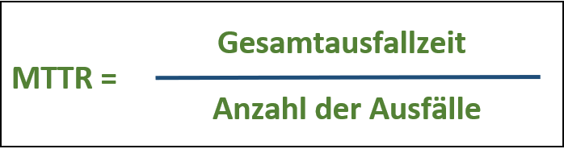

## SCRUM

### Meetings

#### Sprint

- Einzelne Arbeitsphasen heißen Sprints
- In den Sprints arbeitet man selbständig und teilt seine Aufgaben der Gruppe mit
- Scrum zeichnet sich vor allem durch regelmäßige und wiederholbare Arbeitsabläufe aus. Diese Zyklen werden meist Iteration oder Sprint genannt und sind zeitlich beschränkt (2 Wochen)
- Ziel eines jeden Sprints ist es, ein funktionsfähiges Zwischenprodukt, das auch Product-Increment genannt wird, zu entwickeln
- Da die Zeit eines Sprints beschränkt ist, kann sich das Scrum Team jeweils nur auf die Weiterentwicklung der grundlegenden Funktionalität des Zwischenprodukts  und auf kurzfristige Ziele konzentrieren
- Die Dauer des gesamten Sprints ist abhängig von der Deadline der/des Stakeholder:in

#### Daily Scrum

- Täglich stattfindendes Event für Developer
- Sollte nicht länger als 10-15 Minuten dauern
- Fortschritt wird überprüft und Sprint Backlog wird ggf. angepast
- Verbessert Kommunikation und identifiziert Hindernisse

#### Sprint Planning

- Festlegen der Aufgaben, welche im Sprint erledigt werden sollen
- Erstellung durch das gesamte Scrum-Team

#### Sprint Retrospective

- Erfolgt ganz am Ende, nachdem der letzte Sprint vorbei ist
- Es wird über die Zusammenarbeit, die eigene Entwicklung und die Entwicklung des Teams gesprochen
- Zuerst im eigenen Team und anschließend in der Klasse mit den Stakeholdern
- Anschließend wird über mögliche Änderungen diskutiert

#### Planning Poker

- stellt sicher, dass alle genau wissen, was mit den Aufgaben gemeint ist
- Darauf wird (mit wissen über den Aufgabeninhalt) der Zeittplan geregelt
- Vorgang:
  1. Zeitwerte werden auf Kommando aufdeckt
  2. höchsten und niedrigsten Extremwerte müssen erläutert/begründet werden

#### Sprint Review

- Am Ende jedes Sprints
- beantwortet Leitfragen oder Ergebnisse werden Product Owner vorgestellt
- Folgende Leitfragen gibt es:
  - Was haben wir heute geschafft?
  - Wo stehen wir?
  - Wie hat die Zusammenarbeit heute geklappt?
  - Inwieweit sind wir mit dem Ergebnis des heutigen Sprints zufrieden

### Artefakte

#### Akzeptanzkriterien

- gibt erfüllende Bedingungen vor
- wird vom Product Owner vorgegeben
- Beinhaltet: Inhalt, Umfang, Abgabedatum

#### User Stories

- Anforderungen an das Produkt einfach formuliert
- Wird aus Sicht des Nutzers/Kunden erstellt

#### Definition of Done

- Definiert das Projektende/Paketende (Leitfragen)
- Kriterien, die etwas als abgeschlossen markieren

#### Definition of Fun

- Gegebenheiten um mit Spaß zu arbeiten

#### Flip/Kanban Board

- Dokumentation der einzelnen Arbeitsschritte
- Auf einen Blick was noch zutun oder zu erledigen ist (To Do, In Progress, Done...)

#### Product Backlog

- Beinhaltet das Produktziel
- Ziele sind genau Formuliert
- Scrum Team orientiert sich am Backlog

### Rollen

#### Scrum Team

- Besteht üblicherweise aus 10 oder weniger Teammitgliedern
- Besteht aus einem Product Owner, einem Scrum Master und mehreren Entwicklern
- Die Mitglieder des Teams besitzen alle erforderlichen Fähigkeiten, um in einem Sprint einen Wert zu schätzen
- Das Team managed sich intern selbst
- Arbeitet in Sprints, um in diesen ein Increment zu schaffen (Projektaufgaben erledigen)

#### Product Owner

- Product Owner ist der "Produkteigentümer"
- Mitglied des SCRUM Teams
- Zuständig für Entwicklungsprozesse
- Verantwortet Product Backlog & Product Goal
- Aufgaben wie:
  - Produktdokumentation
  - Berichte an GL
  - Teamoptimierung
  - Maximierung des Produkts

#### Scrum Master

- "Coach und Moderator"
- Unterstützung des Teams
- Verantwortung für Scrum-Prozess und dessen korrekte Implementierung
- Unterstützung und Vermittlung zwischen den verschiedenen Rollen
- Beseitugung von Hindernissen
- Direktion des Informationsfluss zwischen Product-Owner und Team
- Moderator in den täglichen Scrum-Meetings
- Teamregeln aufstellen und auf deren Einhaltung achten

#### Stakeholder

- Person, für die es aufgrund ihrer Interessenlage von Belang ist wie das Projekt verläuft (z. B. Aktionär, Mitarbeiter, Kunde)
- Jemand der das System nutzen soll (bzw. nicht nutzen soll)

---

## RAID

Definition: **Redundant Array of Independent Discs**

### Probleme die auftreten können

#### HDD

- Mechanische Defekte (Rotierende Scheiben, Lese-/Schreibkopf)
- Höherer Energiebedarf
- Weniger robust (anfällig für Stöße/Stürze)
- Starke Magnetfelder zerstören die HDD

#### SSD

- Häufige Firmwareprobleme
- Überhitzung
- begrenzte Speicherkapazität
- Begrenzte Schreib-/Löschzyklen

### Anforderungen für sichere Datenspeicherung

#### Kurzzeitige Externe Ausfallsicherheit

- Durchgängige Stromversorgung (USV)
- Notstromgeneratoren für größere Serverräume
- Eigenes Netzwerk für ILOs -> lokaler Zugriff bei Netzausfall

#### Langfristige Externe Ausfallsicherheit

- Speicherung auf zwei verschiedenen Standorten für Absicherung gegen Elementarschäden

#### Interne Ausfälle

- Hoher MTBF-Wert der Disks (Meantime between Failure, Durchschnittliche Zeit bis die Platte ausfällt)

- Niedriger MTTR-Wert (Mean Time to Repair, Durschnittliche Zeit bis zur Reparatur)
  - Auch Mean-Time-To-Recovery, Mean-Team-To-Resolve oder Mean-Time-To-Resolution
  - Wird in Sekunden, Stunden oder Tagen angegeben
  
- Hohe MTTF (Mean Time to Failure, Durchschnittliche Zeit bis zu einem Fehler)

#### RAID Funktionsweisen

- **Striping:** Ein Datensatz wird aufgeteilt auf mehreren aufeinanderfolgenden Festplatten gespeichert. Beim Ausfall einer der Platten sind alle Informationen verloren, da sämtliche Platten zum Lesen des vollständigen Datensatzes benötigt werden.
- **Mirroring:** Ein Datensatz wird auf zwei verschiedenen Festplatten gespeichert. Beim Ausfall einer der beiden Platten gehen keine Informationen verloren, da die selben Informationen noch auf der anderen Festplatte liegen.
- **Parity:** Ein Datensatz wird in Streifen auf mehreren Festplatten verteilt gespeichert. Zusätzlich wird auf einer Platte für jeden Streifen ein Paritätswert errechnet. Beim Ausfall einer Platte kann mit Hilfe des Paritätwerts die fehlende Information errechnet werden.

**Ziel:** Erhöhung der Verfügbarkeit von Daten

### Redundanz

- Es werden mehr Informationen/Systeme vorgehalten, damit bei Ausfall eines Teilsystems das Gesamtsystem trotzdem fehlerfrei weiterarbeiten kann
- Erhöht den Schutz vor Datenverlust und steigert die Verfügbarkeit
