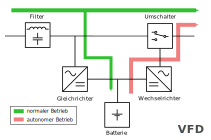
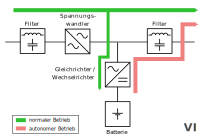
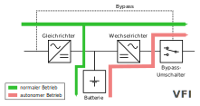

## USV - Unterbrechungsfreie Stromversorgung

### USV - Typen (Arten)

#### VFD - Voltage + Frequency dependent

Schutz vor:

- Spannungsausfall
- Unterspannung

**Achtung: keine Erweiterbarkeit der Akkukapazität!**

#### VI - Voltage Independent

Schutz vor:

- Spannungsausfall
- Unterspannung
- Spannungsschwankungen
- Überspannung
- Spannungsspitzen

**Achtung: keine Erweiterbarkeit der Akkukapazität!**

#### VFI - Voltage + Frequency Independent

Schutz vor:

- Spannungsausfall
- Unterspannung
- Spannungsschwankungen
- Überspannunggit 
- Spannungsspitzen
- Frequenzschwankungen

**Vorteil: Akkus modular erweiterbar.**

### Berechnungen bei USV

## SMB

### Einrichten

- install samba per package manager
- smb.conf create new share at the bottom
