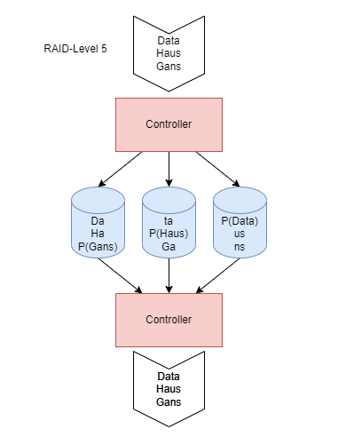
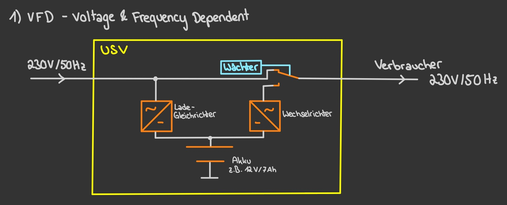

- [Betriebssysteme](#betriebssysteme)
  - [Microsoft Windows vs Linux](#microsoft-windows-vs-linux)
  - [Linux Berechtigungen](#linux-berechtigungen)
  - [Befehle in Linux](#befehle-in-linux)
  - [Befehle in VI](#befehle-in-vi)
- [Skripting in Linux](#skripting-in-linux)
  - [If Else](#if-else)
  - [Switch Case](#switch-case)
- [Netzwerk](#netzwerk)
  - [Aufbau eines Frames](#aufbau-eines-frames)
  - [Frame vs Paket vs Segment](#frame-vs-paket-vs-segment)
  - [TCP-Flags](#tcp-flags)
  - [PAT - Port Address Translation](#pat---port-address-translation)
  - [NAT - Network Address Translation](#nat---network-address-translation)
- [Backup](#backup)
  - [Vollsicherung](#vollsicherung)
  - [Differentielle Sicherung](#differentielle-sicherung)
  - [Inkrementelle Sicherung](#inkrementelle-sicherung)
  - [Archivbit](#archivbit)
- [GIT](#git)
- [RAID](#raid)
  - [Probleme die auftreten können](#probleme-die-auftreten-können)
    - [HDD](#hdd)
    - [SSD](#ssd)
  - [Anforderungen für sichere Datenspeicherung](#anforderungen-für-sichere-datenspeicherung)
    - [Kurzzeitige Externe Ausfallsicherheit](#kurzzeitige-externe-ausfallsicherheit)
    - [Langfristige Externe Ausfallsicherheit](#langfristige-externe-ausfallsicherheit)
    - [Interne Ausfälle](#interne-ausfälle)
    - [RAID Funktionsweisen](#raid-funktionsweisen)
  - [Redundanz](#redundanz)
  - [RAID-Arten](#raid-arten)
    - [RAID 0](#raid-0)
    - [RAID 1](#raid-1)
    - [RAID 3](#raid-3)
    - [RAID 5](#raid-5)
    - [RAID 6](#raid-6)
- [USV - Unterbrechungsfreie Stromversorgung](#usv---unterbrechungsfreie-stromversorgung)
  - [Probleme bei der Stromversorgung](#probleme-bei-der-stromversorgung)
  - [USV - Typen (Arten)](#usv---typen-arten)
    - [VFD - Voltage + Frequency dependent](#vfd---voltage--frequency-dependent)
    - [VI - Voltage Independent](#vi---voltage-independent)
    - [VFI - Voltage + Frequency Independent](#vfi---voltage--frequency-independent)
  - [Berechnungen bei USV](#berechnungen-bei-usv)
- [SMB](#smb)
  - [Einrichten](#einrichten)
- [Virtualisierung](#virtualisierung)
  - [Realisierungsmöglichkeiten](#realisierungsmöglichkeiten)
- [IPv6](#ipv6)
- [SAN / NAS / DAS](#san--nas--das)
  - [SAN](#san)
    - [Vorteile](#vorteile)
    - [Nachteile](#nachteile)
    - [Protokolle](#protokolle)
  - [DAS](#das)
    - [Mögliche Medien](#mögliche-medien)
    - [Vorteile](#vorteile-1)
    - [Nachteile](#nachteile-1)
    - [Schnittstellen](#schnittstellen)
    - [Anschaffung und Administration](#anschaffung-und-administration)
  - [NAS](#nas)
    - [Mögliche Medien](#mögliche-medien-1)
    - [Vorteile](#vorteile-2)
    - [Nachteile](#nachteile-2)
    - [Schnittstellen](#schnittstellen-1)
    - [Administration und Einsatzgebiete](#administration-und-einsatzgebiete)

---

## Betriebssysteme

### Microsoft Windows vs Linux

Microsoft erlaubt keinen direkten Zugriff auf das Betriebssystem Windows. Selbst Admins werden vom Betriebssystem berechtigt, direkter Zugriff existiert nicht.

### Linux Berechtigungen

Beispiel: Datei bla.txt hat die Rechte 754 \
Bedeutung:  user darf r, w, x
            group darf r, x
            alle anderen r

### Befehle in Linux

|Befehl|Beschreibung|
|--|--|
|chmod|Rechte angeben/ändern|
|ls -l|Auflisten der Rechte (+Gruppe)|
|chown|Ändern des Eigentümers einer Datei/eines Dirs|
|chgrp|Ändern der Gruppe|
|cd|Wechseln von Verzeichnissen|
|pwd|Ausgeben des aktuellen Verzeichnispfades|
|cp|Copy|
|rm|Remove|
|touch|Anlegen einer neuen Datei oder Ändern der Metadaten einer Datei|
|cat|Ausgeben der Inhalte einer Datei|
|less|Ausgeben der Inhalte einer Datei in lesbaren Seiten|

### Befehle in VI

Befehlskontext mit ESC öffnen

|Befehl|Beschreibung|
|--|--|
|:w|speichern|
|:q|verlassen|
|:q!|verlassen erzwingen|
|/...|nach ... suchen|
|dd|Zeile löschen|
|i|insert|

## Skripting in Linux

Anordnung von Befehlen, die nacheinander abgearbeitet werden. Diese Befehle werden in eine Datei zur Wiederverwendbarkeit und Automatisierung geschrieben.

- Erste Zeile wird "Shebang"-Zeile genannt
- In der Shebang-Zeile wird die zu verwendende Shell angegeben
- #!/bin/bash (für standard-shell)

|Syntax|Bedeutung|
|--|--|
|#!|Shell-Angabe|
|#|Kommentar|
|$xxx|Ansprache der davor definierten Variable xxx|
|+%x|Formatierungsoption des vorangegangenen Befehls mit Parameter x|

- Variablendeklarationen dürfen keine Leerzeichen enthalten (z.B. varname = xxx)
- Variableninitialisierungen mit Leerzeichen (für Parameter für vordefinierte Befehle) müssen mit **\`**    **\`** (Backticks, nicht Quotation Marks) umrahmt werden

### If Else

if condition 
... 
then 
... 
else/elseif/elif 
... 
fi

### Switch Case

case condition in  
    Möglichkeit 1) ... ;; 
    Möglichkeit 2) ... ;; 
    *) ... ;; 
esac

---

## Netzwerk

- Im physischen Bereich (MAC-Adressenbasiert) wird zuerst die Ziel-MAC und dann die Quell-MAC angegeben (z.B: im Frame-Header).
- Im logischen Bereich (IP-Adressenbasiert) wird zuerst die Quell-IP und dann die Ziel-IP angegeben.
- Der Portbereich ist festgelegt auf 16 Bit (65536 (0-65535) verfügbare Ports, davon die ersten 1024 well-known Ports)
- Es können 4096 VLANs über die VLAN-Erweiterung im Frame-Header addressiert werden (die ersten zwei Byte sind für den Tag Protocol Identifier (TPID) - Bei VLANs 0x8100, die letzten 12 Bit für VLAN ID (-> max 4096))

### Aufbau eines Frames

### Frame vs Paket vs Segment

|Frame|Paket|Segment|
|--|--|--|
|Dateneinheit des Data Link Layers|Dateneinheit der Netzwerkschicht|Dateneinheit der Transportschicht|
|Layer 2|Layer 3|Layer 4|
|MAC-basiert|IP-basiert||

### TCP-Flags

- Zustandssignal
- Immer 1 Bit groß (Zustand ist an oder aus)
- Für 3-Wege-Handshake (SYN, SYN-ACK, ACK)

### PAT - Port Address Translation

Beispiel: Paket wird von PC 1 in internem Netz an Server 1 in externem Netz geschickt.

- Standardgateway ersetzt bei Paketerhalt die Quell-IP und -Port durch seine externe Schnittstelle und einem neuen Quellport für das Netz von Server 1
- Standardgateway setzt für den neuen Port eine Zuordnung zu PC 1 und dem ursprünglichen Port (Router-interne Liste)
- Bei Antwort wird anhand des Portabgleichs mit der internen Liste das richtige Ziel (PC 1 mit Quell-Port) zugeordnet
- Listeneintrag mit "Ersatzport" wird gelöscht
- PAT ist ein 1-zu-n NAT (1 PC in Privatnetz kann übersetzt werden (viele Ports, aber nur 1 PC))

### NAT - Network Address Translation

- Standardgateway ersetzt bei Paketerhalt die Quell-IP durch seine externe Schnittstelle und setzt einen Wert zur Zuordnung des Antwortpakets in die NAT-Tabelle

---

## Backup

### Vollsicherung

|Vorteile|Nachteile|
|--|--|
|||

### Differentielle Sicherung

Eine Vollsicherung wird als Basis zur differentiellen Sicherung benötigt.

|Vorteile|Nachteile|
|--|--|
|Point-In-Time Recovery ab letzter Vollsicherung|Für Recovery ist Vollsicherung und differentielle Sicherung notwendig|
|weniger Zeitaufwand|Doppelte Datensicherung (Datensatz wurde in dem Zeitraum mehrmals geändert)|

### Inkrementelle Sicherung

Eine Sicherung wird als Basis zur inkrementellen Sicherung benötigt, da immer nur die Änderungen zur letzten Sicherung gesichert werden.

|Vorteile|Nachteile|
|--|--|
|Backup benötigt weniger Speicherplatz|alle inkrementellen Sicherungen werden zur Recovery benötigt|
|sehr schnelle Backuperstellung||

### Archivbit

Das Archivbit (auch Archiv-Attribut) ist ein Dateiattribut, das in Microsoft-Betriebssystemen genutzt wird, um neu angelegte oder veränderte Dateien zu kennzeichnen. Datensicherungsprogrammen kann damit signalisiert werden, dass die Datei noch nicht gesichert bzw. seit der letzten Sicherung modifiziert wurde.

---

## GIT

- Zusammenarbeit im Team an einem Projekt
- Versionierung
- Lokale und Onlineversionen des Repos (lokal arbeiten, neuester (stable) Stand online)

---

## RAID

Definition: **Redundant Array of Independent Discs**

### Probleme die auftreten können

#### HDD

- Mechanische Defekte (Rotierende Scheiben, Lese-/Schreibkopf)
- Höherer Energiebedarf
- Weniger robust (anfällig für Stöße/Stürze)
- Starke Magnetfelder zerstören die HDD

#### SSD

- Häufige Firmwareprobleme
- Überhitzung
- begrenzte Speicherkapazität
- Begrenzte Schreib-/Löschzyklen

### Anforderungen für sichere Datenspeicherung

#### Kurzzeitige Externe Ausfallsicherheit

- Durchgängige Stromversorgung (USV)
- Notstromgeneratoren für größere Serverräume
- Eigenes Netzwerk für ILOs -> lokaler Zugriff bei Netzausfall

#### Langfristige Externe Ausfallsicherheit

- Speicherung auf zwei verschiedenen Standorten für Absicherung gegen Elementarschäden

#### Interne Ausfälle

- Hoher MTBF-Wert der Disks (Meantime between Failure, Durchschnittliche Zeit bis die Platte ausfällt)

- Niedriger MTTR-Wert (Mean Time to Repair, Durschnittliche Zeit bis zur Reparatur)
  - Auch Mean-Time-To-Recovery, Mean-Team-To-Resolve oder Mean-Time-To-Resolution
  - Wird in Sekunden, Stunden oder Tagen angegeben
  
- Hohe MTTF (Mean Time to Failure, Durchschnittliche Zeit bis zu einem Fehler)

#### RAID Funktionsweisen

- **Striping:** Ein Datensatz wird aufgeteilt auf mehreren aufeinanderfolgenden Festplatten gespeichert. Beim Ausfall einer der Platten sind alle Informationen verloren, da sämtliche Platten zum Lesen des vollständigen Datensatzes benötigt werden.
- **Mirroring:** Ein Datensatz wird auf zwei verschiedenen Festplatten gespeichert. Beim Ausfall einer der beiden Platten gehen keine Informationen verloren, da die selben Informationen noch auf der anderen Festplatte liegen.
- **Parity:** Ein Datensatz wird in Streifen auf mehreren Festplatten verteilt gespeichert. Zusätzlich wird auf einer Platte für jeden Streifen ein Paritätswert errechnet. Beim Ausfall einer Platte kann mit Hilfe des Paritätwerts die fehlende Information errechnet werden.

**Ziel:** Erhöhung der Verfügbarkeit von Daten

### Redundanz

- Es werden mehr Informationen/Systeme vorgehalten, damit bei Ausfall eines Teilsystems das Gesamtsystem trotzdem fehlerfrei weiterarbeiten kann
- Erhöht den Schutz vor Datenverlust und steigert die Verfügbarkeit

### RAID-Arten

#### RAID 0

**Achtung: keine Redundanz**: bei Ausfall eines Teilsystems sind alle Daten verloren.

Vorteil:

- höherer Datendurchsatz gegenüber nur einer Platte

#### RAID 1

Vorteil:

- ggf. doppelten Lese-Datenzugriff
- Redundanz

Nachteil:

- bei der Verwendung von 2 Festplatten kann nur die Kapazität der kleinsten Platte verwendet werden

**-> Netto <= 0.5 Brutto**

#### RAID 3

Vorteil:

- Redundanz
- Besseres Verhältnis von Netto/Brutto gegenüber RAID 1
- Höherer Datendurchsatz

#### RAID 5

Vorteil:

- höherer Datendurchsatz gegenüber einer Platte
- kein "Flaschenhals"

#### RAID 6

Vorteil:

- Es dürfen 2 Platten ohne Auftreten von Datenverlust ausfallen

Nachteil:

- Aufgrund der verteilten 2 Parity deutlich geringerer Datendurchsatz (Einbezug mehrerer Dateneinheiten)

---

## USV - Unterbrechungsfreie Stromversorgung

### Probleme bei der Stromversorgung

### USV - Typen (Arten)

#### VFD - Voltage + Frequency dependent

Schutz vor:

- Spannungsausfall/einbruch
- Unterspannung

**Achtung: keine Erweiterbarkeit der Akkukapazität!**

#### VI - Voltage Independent

Schutz vor:

- Spannungsausfall/einbruch
- Unterspannung
- Spannungsschwankungen
- Überspannung
- Spannungsspitzen

**Achtung: keine Erweiterbarkeit der Akkukapazität!**

#### VFI - Voltage + Frequency Independent

Schutz vor:

- Spannungsausfall/einbruch
- Unterspannung
- Spannungsschwankungen
- Überspannung
- Spannungsspitzen
- Frequenzschwankungen

**Vorteil: Akkus modular erweiterbar.**

### Berechnungen bei USV

## SMB

### Einrichten

- install samba per package manager
- smb.conf create new share at the bottom

## Virtualisierung

Einzelne Betriebssysteme können gemeinsam, voneinander isoliert auf eine Hardware zugreifen.

### Realisierungsmöglichkeiten

## IPv6

- IPv6 unterstützt nur Automatismen bis zu einer Netzmaske von /64

## SAN / NAS / DAS

- SAN: Storage Area Network
- NAS: Network Attached Storage
- DAS: Direct Attached Storage

### SAN

#### Vorteile

- Schnelle Datenübertragung getrennt vom normalen Netzwerk
- höchste Verfügbarkeit und Leistung
- 

#### Nachteile

#### Protokolle

### DAS

#### Mögliche Medien

- Herkömmliche Festplatten (HDDs)
- SSDs oder Flash-Speicher

#### Vorteile

- günstig in der Anschaffung
- hohe Datentransferrate (Datendurchsatz)
- Geringe Komplexität

#### Nachteile

-

#### Schnittstellen

- eSATA
- Firmwire
- ATA / ATAPI
- SCSI
- USB

#### Anschaffung und Administration

### NAS

#### Mögliche Medien

- HDDs
- SSDs
- Hybride Festplatten (SSHD)
- Optische Medien (CDs)

#### Vorteile

- günstig
- Zugriff durch mehrere Leute
- leicht konfigurierbar und administrierbar
- versatil (nicht beschränkt auf ein Protokoll)
- Möglichkeit auf RAID etc.
- bessere Performance als DAS

#### Nachteile

- begrenzt skalierbar
- nur eine Art von Speichermedium zeitgleich nutzbar
- nicht für größere Datenmengen ausgelegt (z.B. 100TB)
- nutzt bestehendes Netzwerk für Backups

#### Schnittstellen

- Ethernet / RJ45
- USB
- Power Supply

#### Administration und Einsatzgebiete

- Kleinere Firmen
- Mittelständische Unternehmen
- Homelab
- Online oder Lokale Administration
