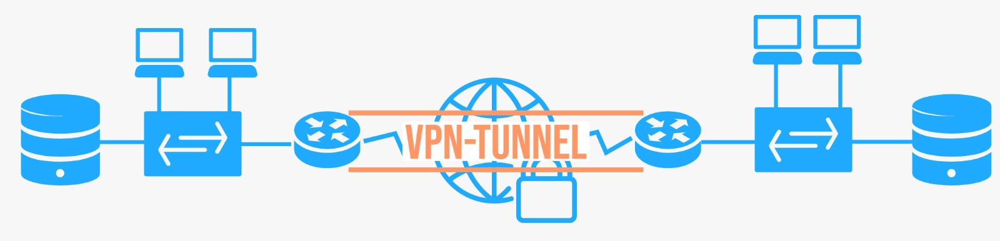
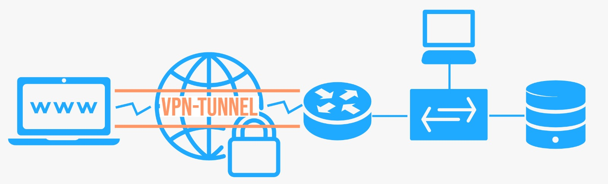

## Datenschutz

### Datenschutz vs Datensicherheit

Datenschutz bezieht sich nur auf personenbezogene Daten und die rechtlichen Zusammenhänge. 
Datensicherheit bezieht sich auf alle Daten und die technischen Maßnahmen diese zu schützen.

### Schutzbedarf feststellen

|Risiko/Gefahr|Schutz durch|
|--|--|
|Phishing-Mails|Spamfilter (Datenfilter|
|Schadsoftware|Virenscanner, Schulungen|
|Sicherheitslücken|Systeme aktuell halten|
|Zugriffe über Client aufs Interne Firmennetz|Login/Sprung-Server, Abgesicherte Serversysteme|
|Breaches|Backup und Datenverschlüsselung|
|Zugriff von Mitarbeitern extern -> Man in the Middle Angriff|VPN-Tunnel/gesicherter Tunnel, verschlüsselte Übertragung|
|(Externe) Angriffe|Firewall, Ip-Filtering, Portumlage|
|Naturgewaltenschutz, Stromausfall|Hochverfügbarkeit, Zwei Serverstandorte, Meldeanlagen|
|Diebstahl|Zutrittskontrolle|
|Layer 8 Problem/Unwissende User|Schulungen|
|Access-Point für Kunden|Proxies etc.|

---

## VPN

- VPN-Client (baut die Verbindung auf),
- VPN-Server (nimmt die Verbindung entgegen) und der
- VPN-Tunnel (logische Verbindung über ein Netzwerk)

Für die Sicherheit der Verbindung ist das VPN-Protokoll (z.B. IPSec) zuständig. Dieses muss von den Kommunikationspartnern unterstützt werden.

### Sichere Datenübertragung

- Vertraulichkeit: Verschlüsselung des Dateninhalts
- Authentizität: SmartCard, Digitale Signaturen
- Integrität: Hashing

### End-To-End VPN

- Host-To-Host-VPN

Ein Host-to-Host-VPN ermöglicht den sicheren Datenaustausch zum Beispiel zwischen zwei Rechnern oder Servern.

### Site-To-Site VPN

- Gateway-To-Gateway-VPN

Werden zwei Standorte, bzw. Netzwerke über ein öffentliches Netzwerk (Internet) mit einander verbunden, spricht man von einem Site-to-Site-VPN. Dieses eignet sich dann, wenn z. B. die Filiale einer Firma an die Zentrale angebunden wird. In diesem
Fall müssen nur die beiden Gateways (i.d.R. VPN-fähige Router) das gleiche VPN-Protokoll sprechen und zueinander einen VPN-Tunnel aufbauen.

### End-To-Site VPN

- Host-To-Gateway-VPN
- Remote-Access-VPN

Ein Außendienstmitarbeiter verbindet sich vom Notebook über das Internet mit der Firmenzentrale. Diese Variante ist das sogenannte Client-to-Site-VPN. Andere Namen dafür sind Access-VPN oder User-to-Site-VPN. Auf dem Notebook muss
dazu ein VPN-Client (Software) installiert sein. VPN-Server ist in diesem Beispiel der VPN-Router, er beherrscht das gleiche VPN-Protokoll.
