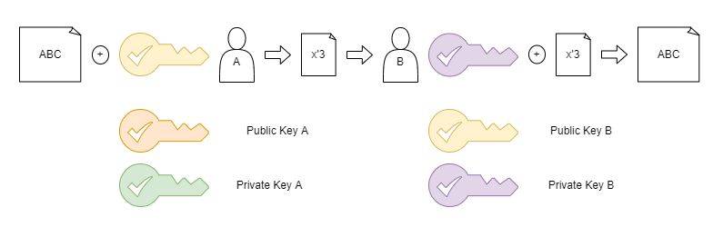

## Kryptologie

### Symmetrische Verschlüsselung

#### Merkmale

- Kommunikationspartner verwenden den gleichen Schlüssel
- Kommunikationspartner verwenden das gleiche Verschlüsselungsverfahren

#### Nachteile

- Schlüsselaustauschproblem
- Hohe Anzahl an Schlüsseln
- Schlüsselmanagement

#### Vorteile

- benötigt wenig Rechenleistung

#### Beispiele

- DES
- 3DES (Triple DES)
- AES
- Serpent

### Asymmetrische Verschlüsselung

#### Merkmale

Eine Nachricht, die mit einem Schlüssel eines Schlüsselpaares verschlüsselt wird, muss mit dem anderen Schlüssel entschlüsselt werden.

- Vertraulichkeit: Verschlüsselung mit Public Key des Kommunikationspartners.
- Authentizität: Verschlüsselung mit dem eigenen Private Key

#### Nachteile

- hohe Rechenleistung erforderlich

#### Beispiele

- RSA

