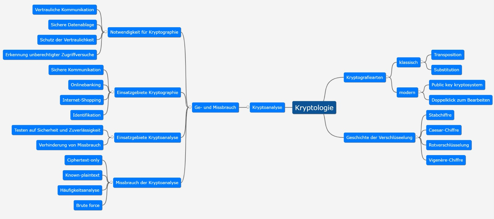
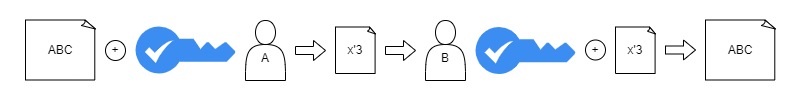

## Kryptologie

### Symmetrische Verschlüsselung

#### Merkmale

- Kommunikationspartner verwenden den gleichen Schlüssel
- Kommunikationspartner verwenden das gleiche Verschlüsselungsverfahren

#### Nachteile

- Schlüsselaustauschproblem
- Hohe Anzahl an Schlüsseln
- Schlüsselmanagement

#### Vorteile

- benötigt wenig Rechenleistung

#### Beispiele

- DES
- 3DES (Triple DES)
- AES
- Serpent
