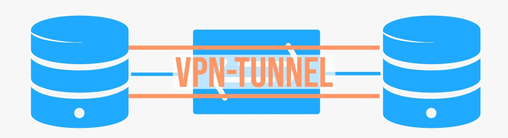
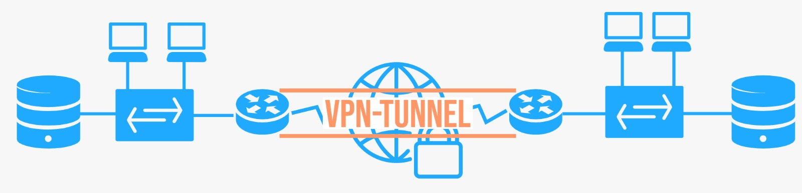
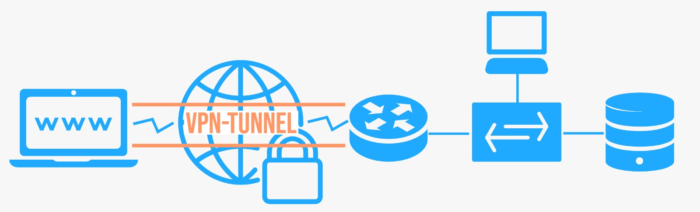
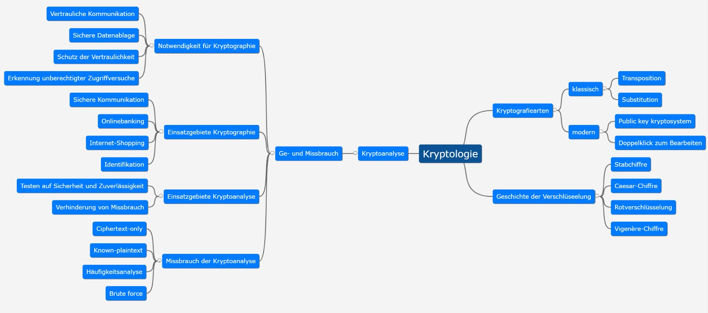
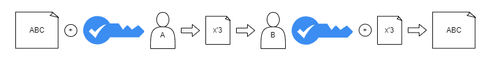
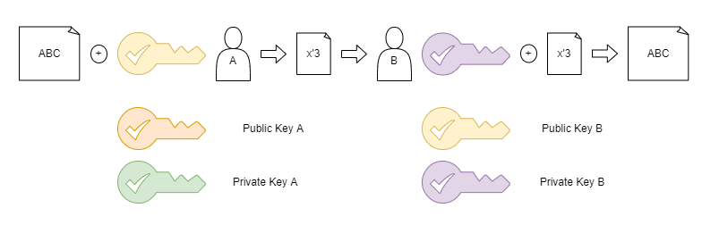
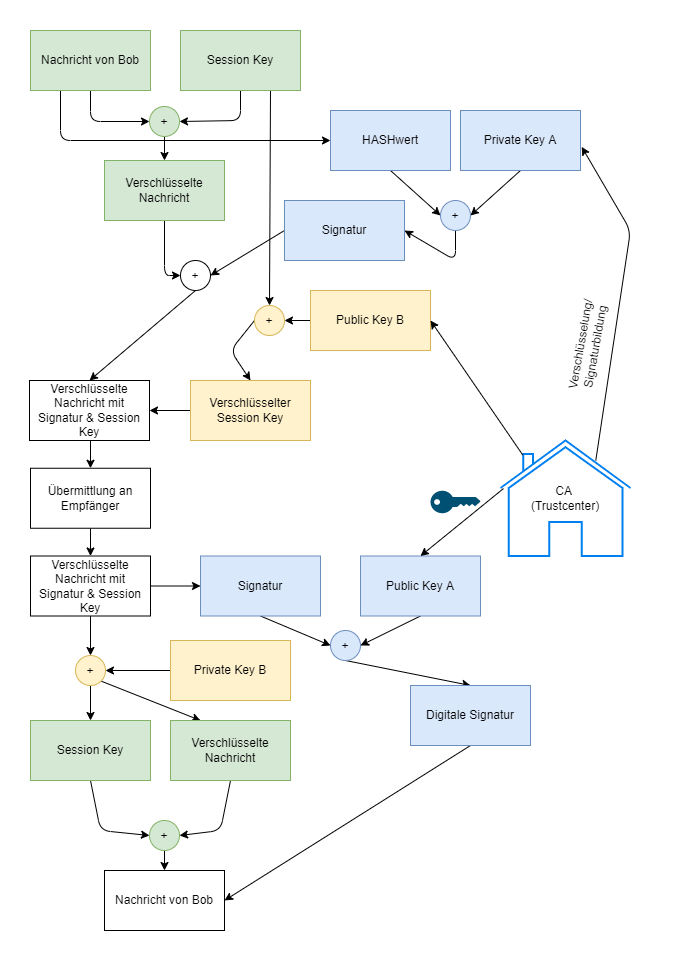
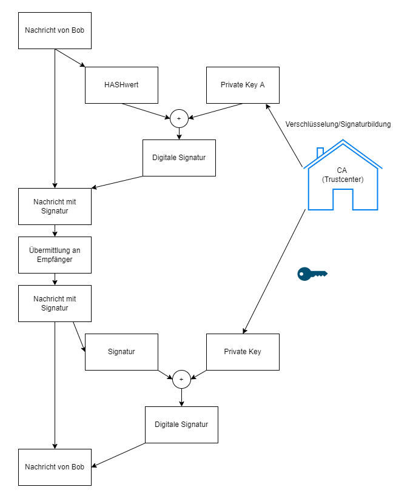

- [Datenschutz](#datenschutz)
  - [Datenschutz vs Datensicherheit](#datenschutz-vs-datensicherheit)
  - [Schutzbedarf feststellen](#schutzbedarf-feststellen)
- [VPN](#vpn)
  - [Sichere Datenübertragung](#sichere-datenübertragung)
  - [End-To-End VPN](#end-to-end-vpn)
  - [Site-To-Site VPN](#site-to-site-vpn)
  - [End-To-Site VPN](#end-to-site-vpn)
  - [VPN und VDI](#vpn-und-vdi)
  - [AH und ESP](#ah-und-esp)
- [Kryptologie](#kryptologie)
  - [Symmetrische Verschlüsselung](#symmetrische-verschlüsselung)
    - [Merkmale](#merkmale)
    - [Nachteile](#nachteile)
    - [Vorteile](#vorteile)
    - [Beispiele](#beispiele)
  - [Asymmetrische Verschlüsselung](#asymmetrische-verschlüsselung)
    - [Merkmale](#merkmale-1)
    - [Nachteile](#nachteile-1)
    - [Beispiel](#beispiel)
  - [Hybride Verschlüsselung](#hybride-verschlüsselung)
  - [PKI](#pki)

---

## Datenschutz

### Datenschutz vs Datensicherheit

Datenschutz bezieht sich nur auf personenbezogene Daten und die rechtlichen Zusammenhänge. 
Datensicherheit bezieht sich auf alle Daten und die technischen Maßnahmen diese zu schützen.

### Schutzbedarf feststellen

|Risiko/Gefahr|Schutz durch|
|--|--|
|Phishing-Mails|Spamfilter (Datenfilter|
|Schadsoftware|Virenscanner, Schulungen|
|Sicherheitslücken|Systeme aktuell halten|
|Zugriffe über Client aufs Interne Firmennetz|Login/Sprung-Server, Abgesicherte Serversysteme|
|Breaches|Backup und Datenverschlüsselung|
|Zugriff von Mitarbeitern extern -> Man in the Middle Angriff|VPN-Tunnel/gesicherter Tunnel, verschlüsselte Übertragung|
|(Externe) Angriffe|Firewall, Ip-Filtering, Portumlage|
|Naturgewaltenschutz, Stromausfall|Hochverfügbarkeit, Zwei Serverstandorte, Meldeanlagen|
|Diebstahl|Zutrittskontrolle|
|Layer 8 Problem/Unwissende User|Schulungen|
|Access-Point für Kunden|Proxies etc.|

---

## VPN

- VPN-Client (baut die Verbindung auf),
- VPN-Server (nimmt die Verbindung entgegen) und der
- VPN-Tunnel (logische Verbindung über ein Netzwerk)

Für die Sicherheit der Verbindung ist das VPN-Protokoll (z.B. IPSec) zuständig. Dieses muss von den Kommunikationspartnern unterstützt werden.

### Sichere Datenübertragung

- Vertraulichkeit: Verschlüsselung des Dateninhalts
- Authentizität: SmartCard, Digitale Signaturen
- Integrität: Hashing

### End-To-End VPN

- Host-To-Host-VPN

Ein Host-to-Host-VPN ermöglicht den sicheren Datenaustausch zum Beispiel zwischen zwei Rechnern oder Servern.

### Site-To-Site VPN

- Gateway-To-Gateway-VPN

Werden zwei Standorte, bzw. Netzwerke über ein öffentliches Netzwerk (Internet) mit einander verbunden, spricht man von einem Site-to-Site-VPN. Dieses eignet sich dann, wenn z. B. die Filiale einer Firma an die Zentrale angebunden wird. In diesem
Fall müssen nur die beiden Gateways (i.d.R. VPN-fähige Router) das gleiche VPN-Protokoll sprechen und zueinander einen VPN-Tunnel aufbauen.

### End-To-Site VPN

- Host-To-Gateway-VPN
- Remote-Access-VPN

Ein Außendienstmitarbeiter verbindet sich vom Notebook über das Internet mit der Firmenzentrale. Diese Variante ist das sogenannte Client-to-Site-VPN. Andere Namen dafür sind Access-VPN oder User-to-Site-VPN. Auf dem Notebook muss
dazu ein VPN-Client (Software) installiert sein. VPN-Server ist in diesem Beispiel der VPN-Router, er beherrscht das gleiche VPN-Protokoll.

### VPN und VDI

- VDI: Virtual Desktop Infrastructure - Virtuelle Desktops, welche über ein Rechenzentrum zur Verfügung gestellt werden
- DaaS: Desktop as a Service - Bereitstellung eines Virtuellen Desktops über eine Cloud-Infrastruktur

|VPN|VDI|
|--|--|
|Datenverarbeitung auf Client-Maschine|Datenverarbeitung auf Virtual Desktop|
|Benötigt hohe Bandbreite|-|
|Daten werden lokal gespeichert|Daten liegen auf VD im RZ|
|Zugriff auf Anwendungen nur bei Kompatibilität mit Client-Betriebssystem|Zugriff auf Anwendungen auch von anderen Betriebssystemen aus möglich|
|Ver-/Entschlüsselung auf Netzwerkebene (Entschlüsselung bereits bei den Routern)|hohe Datensicherheit (erst auf Layer 7 des Anwenders entschlüsselt|
|relativ billig (Software auf Routern aktivieren/installieren)|teurer, zusätzliche Hard- unf Software|
||mehr Konfigurationsaufwand|

### AH und ESP

- AH: Authentication Header
- ESP: Encapsulating Security Payload
- AH authentifiziert IP-Pakete, verschlüsselt aber nicht
- ESP verschlüsselt IP-Pakete zusätzlich
- Im Tansportmodus werden die Daten eines IP-Pakets verschlüsselt
- Im Tunnelmodus wird das gesamte IP-Paket verschlüsselt (Header ausgetauscht)

[Hedgedoc](https://ip-generation.de/F2ThXrIGQJOopuFqHNrjkw)

---

## Kryptologie

### Symmetrische Verschlüsselung

#### Merkmale

- Kommunikationspartner verwenden den gleichen Schlüssel
- Kommunikationspartner verwenden das gleiche Verschlüsselungsverfahren

#### Nachteile

- Schlüsselaustauschproblem
- Hohe Anzahl an Schlüsseln
- Schlüsselmanagement

#### Vorteile

- benötigt wenig Rechenleistung

#### Beispiele

- DES
- 3DES (Triple DES)
- AES
- Serpent

### Asymmetrische Verschlüsselung

#### Merkmale

Eine Nachricht, die mit einem Schlüssel eines Schlüsselpaares verschlüsselt wird, muss mit dem anderen Schlüssel entschlüsselt werden.

- Vertraulichkeit: Verschlüsselung mit Public Key des Kommunikationspartners.
- Authentizität: Verschlüsselung mit dem eigenen Private Key

#### Nachteile

- hohe Rechenleistung erforderlich

#### Beispiel

- RSA
  
### Hybride Verschlüsselung

### PKI

Public Key Infrastructure

